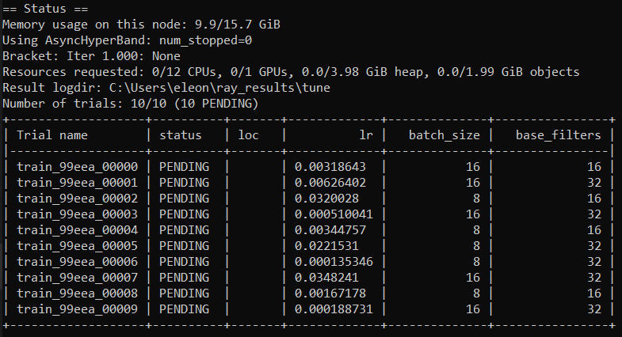

# Reproducible Deep Learning

## Extra: Ray Tune for distributed hyperparameter tuning

### Authors: [Eleonora Grassucci](https://github.com/eleGAN23), [Valerio Guarrasi](https://github.com/guarrasi1995), [Andrea Marcocchia](https://github.com/andremarco)

[[Official reprodl website]](https://www.sscardapane.it/teaching/reproducibledl/)

Before going into this branch, please look at the main branch in order to understand the project details.
> :warning: **extra** branches implement additional exercises created by the students of the course to explore additional libraries and functionalities. They can be read independently from the main branches. Refer to the original authors for more information.

## Goal
Ray Tune is a tool for hyperparameters tuning in a local or distributed fashion. It is integrated in TensorBoard and easy to add in a PyTorch code.

## Prerequisites
Start uncompressing the [ESC-50 dataset](https://github.com/karolpiczak/ESC-50) inside the *data* folder and installing the generic requirements:

```bash
pip install -r requirements.txt
```

As reported in the [documentation](https://docs.ray.io/en/latest/installation.html), Ray fully supports MacOS and Linux. Windows requires Visual C++ dependencies, check it [here](https://docs.ray.io/en/latest/installation.html#windows-support). 

To install Ray Tune follow:

```bash
pip install -U ray
```

## Instructions

In your code, add imports:

```python
from ray import tune
from ray.tune import CLIReporter
from ray.tune.schedulers import ASHAScheduler
```

The information passing between your model and Tune is performed by the `tune.report` method.
Here is an example of reporting validation loss and accuracy:

```python
tune.report(loss=validation_loss, accuracy=val_acc)
```

If using PyTorch Lightning, Ray Tune exploits the [Callbacks](https://pytorch-lightning.readthedocs.io/en/latest/callbacks.html) methods from the framework and build the `TuneReportCallback`. When defining the PyTorch Lightning (`pl`) Trainer, you can specify `TuneReportCallback` as callback:

```python
trainer = pl.Trainer(max_epochs=1, gpus=0, progress_bar_refresh_rate=0,
                         callbacks=[TuneReportCallback({"val_acc": "val_acc"}, on="validation_end")])
```

The callback takes the validation accuracy `val_acc` from the PyTorch Lightning Trainer and reports it to Tune.

The hyperparameter grid is a Python dictionary:

```python
config = {"lr": tune.loguniform(1e-4, 1e-1),
          "batch_size": tune.choice([32, 64])}
```

Finally, the search is performed through `tune.run` in which it is possible to specify the resources allocated to perform the search.

```python
result = tune.run(
    partial(train_cifar, data_dir=data_dir),
    resources_per_trial={"cpu": 8, "gpu": 2},
    config=config,
    num_samples=num_samples,
    scheduler=scheduler,
    progress_reporter=reporter,
    checkpoint_at_end=True)
```

During training, if TensorBoard is installed, hyperparameters are automatically tracked and visualized in TensorBoard:

```bash
tensorboard --logdir ~/ray_results
```

A sample output of Ray Tune while training the net in `train.py`:


