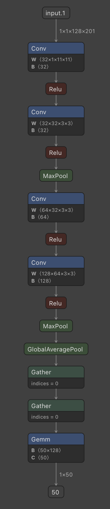

# Reproducible Deep Learning
## Extra: Visualizing Neural Network Models using Netron
### Authors: [Maria Sofia Bucarelli](https://github.com/memis12), [Andrea Mastropietro](https://github.com/AndMastro)

[[Official website](https://www.sscardapane.it/teaching/reproducibledl/)]

> :warning: **extra** branches implement additional exercises created by the students of the course to explore additional libraries and functionalities. They can be read independently from the main branches. Refer to the original authors for more information.

&nbsp;

## Overview

**Netron** allows developers and researchers to visualize neural network models internal structure for inspection and debugging purposes. It comes in handy especially for complex and large models, where it would be hard to follow the data flow and the operations in the network without a graphical aid.

The original **Netron** github repository can be found [here](https://github.com/lutzroeder/netron).\
Netron presents also an [online interface](https://netron.app) to load and visualize pretrained models. 

&nbsp;

## Requirements
In order to use Netron, you need the following:

1. For MacOS users:
    ```bash 
    brew install netron
    ```
   For Linux users:
   ```bash 
   snap install netron
   ```
   For Windows users:
   ```bash 
   snap install netron
   ```
2. Install `netron` package using `pip`:
    ```bash
    pip install netron
    ```
3. Run Netron:
   ```bash
   netron [YOUR_MODEL]
   ``` 
4. Open your browser on http://localhost:8080 to visualize and interact woith your deep learning model

## Use Netron with your model

Netron supports many model formats, among which ONNX, TensorFlow Lite, Keras, Caffe and it has experimental support for PyTorch.\
We use ONNX models as an example. Pytorch Lightning allows to export models to ONNX format:

```python

filepath = "your_model_path.onnx" #the path where your model will be stored

your_model = ... #train your favorite NN model

input_sample = ... # dummy input variable of the correct size

your_model.to_onnx(filepath, input_sample, export_params=True) #export your model to ONNX format

```

As show in the code, we need a dummy input variable to generate the graph and produce an ONNX model, since PyTorch execution graph is dynamically built.

The file ```train.py``` can be used to train and save the model, that can be later inspected using Netron.

Here is an example visualization from the model implemented:


