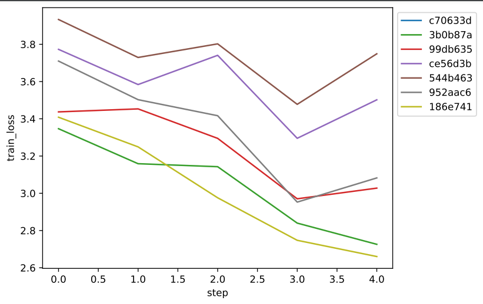

# Reproducible Deep Learning
## Extra: KeepSake for tracking experiments
### Authors: [Marco Zecchini](https://github.com/marcozecchini), [Tommaso Lanciano](https://github.com/tlancian), [Matteo Bohm](https://github.com/matteoboh)

[[Official reprodl website](https://www.sscardapane.it/teaching/reproducibledl/)]
[AutoML Groups Freiburg and Hannover](http://www.automl.org/)
[[Official Auto-PyTorch Repository](https://github.com/automl/Auto-PyTorch/)]


> ⚠️ extra branches implement additional exercises created by the students of the 
> course to explore additional libraries and functionalities. They can be read 
> independently from the main branches. Refer to the original authors for more information.

## Description
[Keepsake](https://github.com/replicate/keepsake) is a version control tool for machine learning.

It allows to track everything about an **experiment** (i.e. a run of our training script): code, hyperparameters, training data, weights, metrics, Python dependencies, etc., so that one can easily figure out how a model was trained. This is done through **checkpoints**: each of them represent a version of the outputs of the training process.

Each and every experiment, together with its checkpoints, is automatically stored into a **repository** that can be easily defined in the ```keepsake.yaml``` file, and that can be stored on Amazon S3, Google Cloud Storage, or even on the local disk.

## Prerequisites

1. Uncompress the [ESC-50 dataset](https://github.com/karolpiczak/ESC-50) inside the *data* folder.
2. Install the requirements:

```bash
pip install -r requirements.txt
```
## Instructions

### Defining the repository
First, create the ```keepsake.yaml```. It should contain a single, simple, line describing the location where Keepsake can store the experiments and checkpoints.
For example, for storing locally:

```
repository: "file://keepsake-repository-reprodl"
```

See [here](https://keepsake.ai/docs/reference/yaml#repository) for more details and examples.

In this exercise, we will use local storage for agile use of makefiles, but we also succesfully used Google Cloud Storage by [installing Google Cloud SDK](https://cloud.google.com/sdk/docs) (they give $300 in free credits to newly registered users) and following a few simple instructions collected [here](https://keepsake.ai/docs/guides/cloud-storage).

### Using Keepsake with PyTorch Lightning
Keepsake includes a callback that makes it easy to use both with **PyTorch** and **Keras**.
We just need to import the ```KeepsakeCallback```:

```python
from keepsake.pl_callback import KeepsakeCallback
```

and put it in our ```Trainer```, including:
- the metric to minimize/maximize (```primary_metric```),
- the number of epochs after which ```KeepsakeCallback``` should save the model (```period```),
- a dictionary of hyperparameters that will be recorded to the experiment at the start of training (```params```),
For example:

```python
trainer = pl.Trainer(**cfg.trainer, checkpoint_callback=False, callbacks=[KeepsakeCallback(primary_metric=("train_loss", "minimize"), period=1, 
                                                                                           params =  {"base_filters": cfg['model']["base_filters"], 
                                                                                                      'n_classes': cfg['model']['n_classes'], 
                                                                                                      'learning_rate': cfg['model']['optimizer']['lr']})])
```

Once concluded, each experiment's information can be accessed from bash through:

```bash
keepsake ls
```
Or through the Python library:
```python
exp = keepsake.experiments.list()
```

And we can easily compare the performance of our model within different experiments:




### A step forward: makefiles

